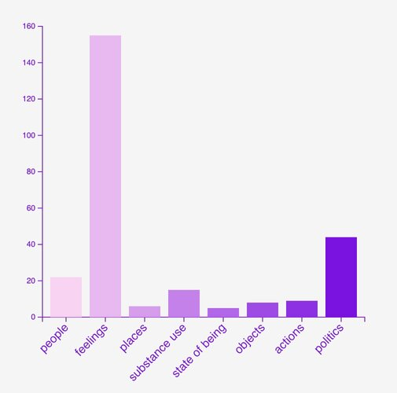
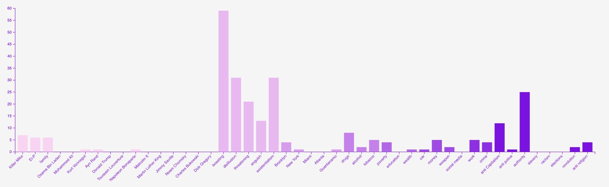
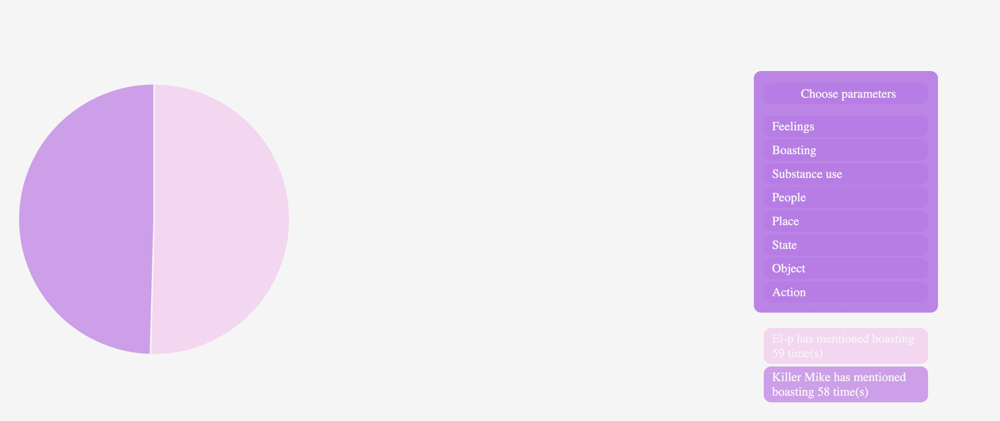
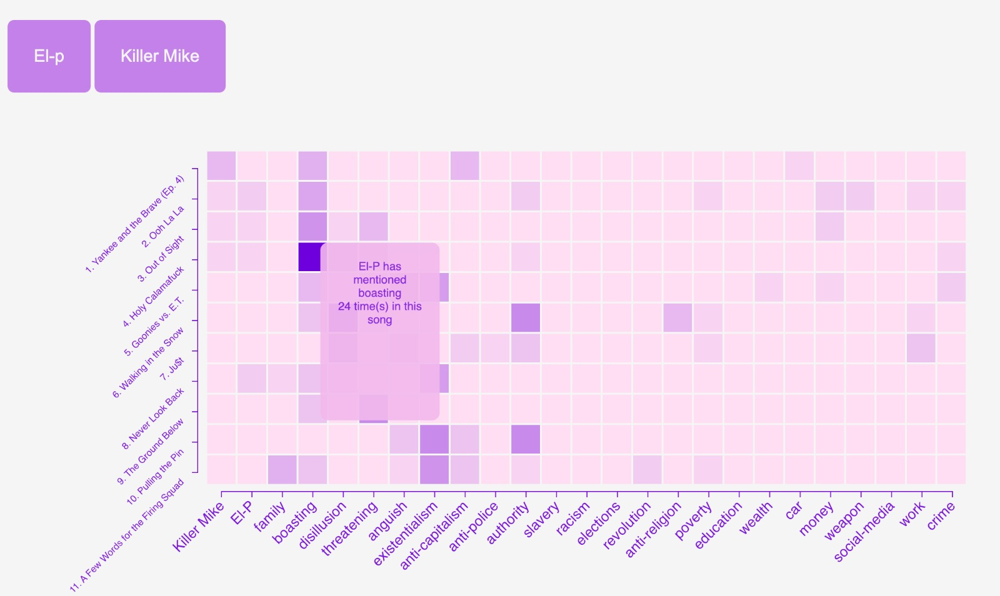

# **'RTJ4' by Run the Jewels – A visualtion**

## **Project description**
<!-- description (obj, target audience, key features) -->

'RTJ4' is the fourth studio album by the American hip-hop duo Run the Jewels. Released in June 2020 on the heels of the murder of George Floyd, it has garnered widespread critical acclaim for the members' unflinching stance on topics ranging from social injustice and police brutality to topical political events. Throughout their longstanding collaborative years, the duo – composed of Brooklyn-based producer and rapper El-P (Jaime Maline) and Atlanta hip-hop veteran Killer Mike (Michael Santiago Render) – have balanced a complementary yet differing artistic style when it comes to the content that they choose to tackle in their lyrics. This project aims to explore the dynamic between both rappers by breaking down the lyrical content of 'RTJ4' into general categories, each containing a range of pertinent subtopics. In doing so, we hope to offer fans and newcomers to the music Run the Jewels alike an engaging visual and interactive insight into the similarities and differences between El-P and Killer Mike by offering a chance to compare and contrast their lyrics.

## **Data sources**
<!-- data collection, organisation and data visualisation -->

In order to produce these visual lyrical insights, we have manually combed through all eleven track featured on 'RTJ4' via [the album's dedicated page on genius.com](https://genius.com/albums/Run-the-jewels/Rtj4) and analysed each of their lines, breaking them down by speaker. Each line's content (determined by either direct or indirect references and tone) was considered, categorised into specific subgroups, then placed in one of eight main categories: 

1. Person – An individual or group of people, whether a member of Run the Jewels, a family member, writer, philospher etc.

2. Feeling - A reference to a particular feeling, such as anguish, disillusion or boasting (understood here not only in the strict definition of the word, but also in terms of triumph and/or glee).

3. Politics – A reference to a politically-charged topic such as anti-police sentiments, anti-capitalism, racism or systemic and/or governmental authority.

4. Place - A reference to a specific geographic location

5. State - Understood here as a state of being, in other words, wealth, poverty or education.

6. Object - A reference to either weapons, money, social media or the duo's beloved 1987 Buick Regal Grand National car.

7. Action – A reference to an act either relating to crime or work.

8. Substance use – A reference to drugs, alcohol or tobacco.

Once this data was sorted and collected, it was compiled [in a csv file](RTJ4.csv) from which our visualisation could take shape. In order to make the reasoning behind this categorisation process as transparent and understandable as possible, we have also included a [bastardised csv repository](RTJ4_Repo.csv) which contains each track's line number, content, category and subcategory.

## **Graph presentation**

We have created four graphs for the purposes of this project to allow viewers to contrast and compare the lyrical themes between El-P and Killer Mike, based on the number of instances a category or a subcategory is mentioned. 

### I. A bar graph to give a general overview of the broad lyrical themes for El-P and Killer Mike across the entire 'RTJ4' album.

The first graph produced is a bar chart which shows how many times El-P and Killer Mike have mentioned each one of the eight main categories specified above throughout the entirety of 'RTJ4'.   

  

We have included two buttons located at the top of the page to enable the viewer to toggle between both El-P and Killer Mike's data in order to compare results, as well as a tooltip to hover over each bar to get an exact reading for their value.  

 

### II. A second bar graph to give a more in-depth overview of the thematic subcategories across the entire 'RTJ4' album.

The second graph offers a more comprehensive breakdown of each of the main eight categories into their component subcategories. The aforementioned buttons will also enable the user to toggle the chart's data between El-P and Killer Mike. Eachs subcategory has been color-coded to correspond to their respective main category. Once more, the use can hover over each individual bar in order to get an exact reading of their value.

### III. A pie graph to offer viewers a side-by-side comparison of El-P and Killer Mike's lyrical themes across the entire 'RTJ4' album.

The third graph is a pie chart which offers the user a side by side comparison of each of the eight main categories between El-P and Killer Mike. The user can toggle between each category and read the results given beneath the parameter selection. The graph and its results are colour-coded according to each speaker.

### IV. A heat map to give viewers a detailed overview of each speaker's lyrical themes by song.

The fourth and final graph is a heatmap showing the number of instances each speaker has mentioned certain sub-categories by song. The subcategories have been selected at our discretion in order to convey the most important lyrical themes in each song. As is the case for the bar charts, users can toggle between speakers using the buttons provided, and may hover over each cell to get an exact reading of their value. 

## **Project progress summary**
- A significant amount of time was spent compiling, analysing, and categorising each line of 'RTJ4'. This process is by no means objective as it requires no small measure of personal interpretation. The explicative annotations provided on the album's Genius.com page were helpful in the categorisation process, however the subcategory under which a song's line would fall largely rested with our own personal understanding of what said line meant to convey. Some lines were entered into our data more than once when it convey multiple meanings. For example, line 32 of the album's sixth track ("The most you give's a Twitter rant and call it a tragedy") was entered twice as it refers both to social media and conveys a feeling of disillusion.

- As each graph was created seperately from one another the process of placing them all on a single page presented some roadblocks, mainly due to variable naming and syntax issues. Standardising our code across all graphs took longer than expected.

## **Conclusion**

We hope that this project offers viewers a better insight into the lyrical messages that each member of Run the Jewels tackle throughout the album – both as a general overview of the album's overarching themes as well as each song's more specific subjects. We believe that, for the most part, this project fulfills this aim as it reflects El-P's and Killer Mike's common lyrical content-matter as well as their individual styles and concerns. For example, one can see from this data that El-P is more heavily focused on broad questions of existentialism and anguish, usually in response to his anti-capitalism views and dislike of contemporary authoritative figures and/or systems. On the other hand, Killer Mike's data reflects his life experience as an African-American man, as he refers to themes of slavery, racism and anti-police sentiment more often than his counterpart.  

Ideally, this project would have spanned the entired of Run the Jewel's discography. Due to the significant amount of time it takes to manually comb through and sort each line's theme(s) however, it was decided to restrict our analysis to 'RTJ4'.

## **Tools used**
- This project was conducted using the D3 JavaScript library and Visual Studio Code.

- This project was a collaborative effort produced in-person and using Visual Studio Code's Live Share extension. Commit rates are therefore not representative of the overall work distribution as they were made by whomever hosted the Live Share during collaboration sessions. 

