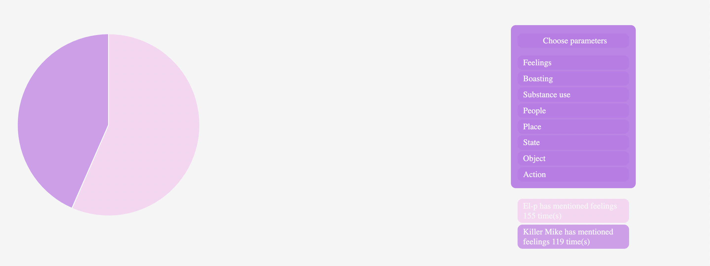

# **'RTJ4' by Run the Jewels – A visualtion**

## Project description
<!-- description (obj, target audience, key features) -->

'RTJ4' is the fourth studio album by the American hip-hop duo Run the Jewels. Released in June 2020 on the heels of the murder of George Floyd, it has garnered widespread critical acclaim for the members' unflinching stance on topics ranging from social injustice and police brutality to topical political events. Throughout their longstanding collaborative years, the duo – composed of Brooklyn-based producer and rapper El-P (Jaime Maline) and Atlanta hip-hop veteran Killer Mike (Michael Santiago Render) – have balanced a complementary yet differing artistic style when it comes to the content that they choose to tackle in their lyrics. This project aims to explore the dynamic between both rappers by breaking down the lyrical content of RTJ4 into general categories, each containing a range of pertinent sub-topics. In doing so, we hope to offer fans and newcomers to the music Run the Jewels alike an engaging visual and interactive insight into the similarities and differences between El-P and Killer Mike by offering a chance to compare and contrast their lyrics.

## Data sources
<!-- data collection, organisation and data visualisation -->

In order to produce these visual lyrical insights, we have manually combed through all eleven track featured on 'RTJ4' via [the album's dedicated page on genius.com](https://genius.com/albums/Run-the-jewels/Rtj4) and analysed each of their lines, breaking them down by speaker. Each line's content (determined by either direct or indirect references and tone) was considered, categorised into specific sub-groups, then placed in one of eight main categories: 

1. Person – An individual or group of people, whether a member of Run the Jewels, a family member, writer, philospher etc.

2. Feeling - A reference to a particular feeling, such as anguish, disillusion or boasting (understood here not only in the strict definition of the word, but also in terms of triumph and/or glee).

3. Politics – A reference to a politically-charged topic such as anti-police sentiments, anti-capitalism, racism or systemic and/or governmental authority.

4. Place - A reference to a specific geographic location

5. State - Understood here as a state of being, in other words, wealth, poverty or education.

6. Object - A reference to either weapons, money, social media or duo's beloved 1987 Buick Regal Grand National car.

7. Action – A reference to an act either relating to crime or work.

8. Substance use – A reference to drugs, alcohol or tobacco.

Once this data was sorted and collected, it was compiled [in a csv file](RTJ4.csv) from which our visualisation could take shape. In order to make the reasoning behind this categorisation process as transparent and understandable as possible, we have also included a [bastardised csv repository](RTJ4_Repo.csv) which contains each track's line number number, content, category and subcategory.

## Graph presentation
<!-- presentation of each visualisation -->

We have created four graphs for the purposes of this project to allow viewers to contrast and compare the lyrical themes between El-P and Killer Mike, based on the number of instances a category or a subcategory is mentioned. 

### I. A bar graph to give a general overview of the broad lyrical themes for El-P and Killer Mike across the entire 'RTJ4' album.

The first graph produced is a bar chart which shows how many times El-P and Killer Mike have mentioned each one of the eight main categories specified above throughout the entirety of 'RTJ4'. 

{height: 50px} <!-- Need to resize -->

We have included two buttons located at the top of the page to enable the viewer to toggle between both El-P and Killer Mike's data in order to compare results, as well as a tooltip to hover over each bar and get an exact reading for their value.

 

### II. A second bar graph to give a more in-depth overview of the thematic subcategories across the entire 'RTJ4' album.

The second graph offers a more comprehensive breakdown of each of the main eight categories into their component subcategories. The aforementioned buttons will also enable the user to toggle the chart's data between El-P's and Killer Mike. Eachs subcategory has been color-coded to correspond to their respective main category. The user can once more hover over each individual bar in order to get an exact reading of their value.

### III. A pie graph to offer viewers a side-by-side comparison of El-P and Killer Mike's lyrical themes across the entire 'RTJ4' album.

- Explanation (direct side by side comparison for the main categories with results given on the right of the page toggle via divs)

### IV. A heat map to give viewers a detailed overview of each speaker's lyrical themes by song.
- Explanation: 

+ button to toggle 
+ tooltip

## Project progress summary
- significant time spent compiling data
- difficulties adding the various HTMLs together?
- Acknowledge the repetitive/copy pasting of the data/group making?

## Conclusion
<!-- I will add some analysis examples (aka existentialism El-P vs Killer Mike/ people mentioned (KM= heavy emphasis on MLK/Toussain/Malcolm X) or places (KM = Atlanta, El-P Brooklyn))-->

## Tools used
This project was conducted using the D3 JavaScript library and Visual Studio Code.

- Live share utilised as we worked together in person therefore the commits to this Github are not reflective of the work distribution.

